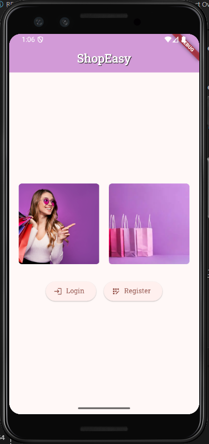
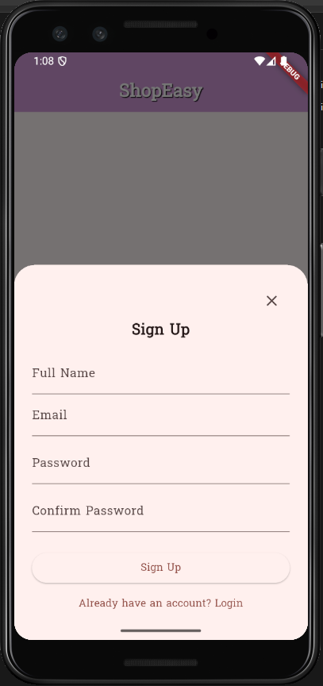
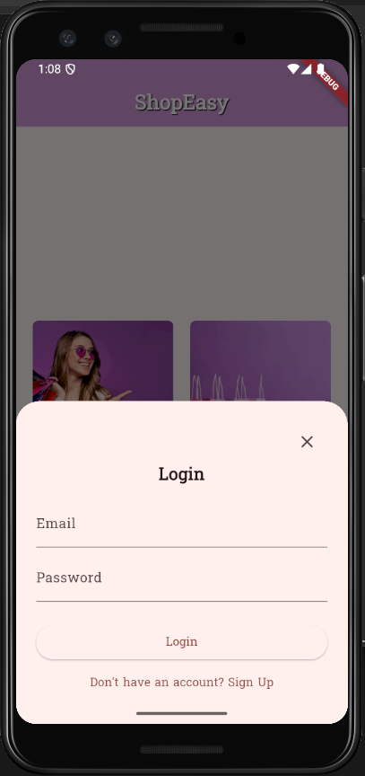
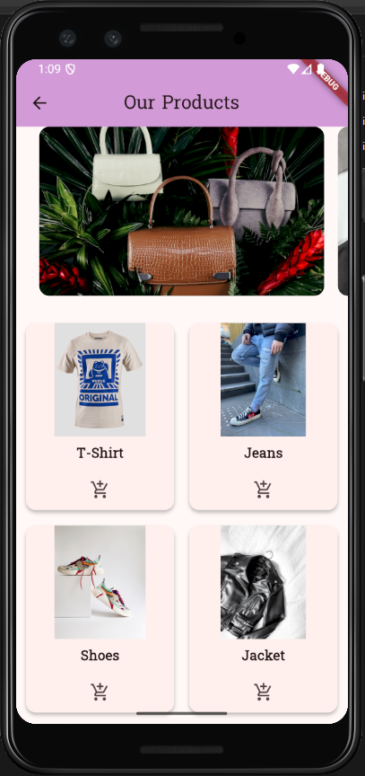
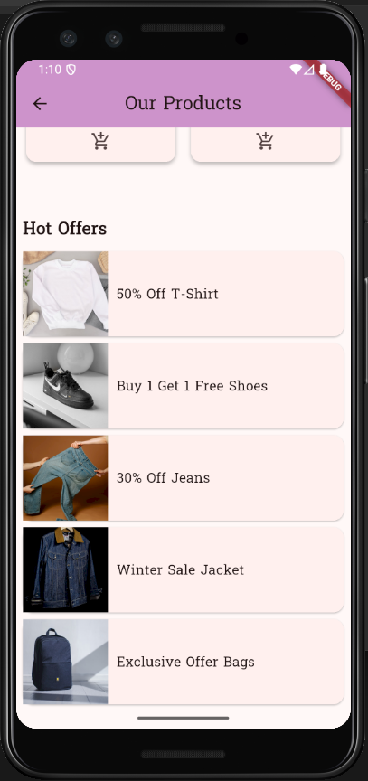

# Flutter Shopping App 🛒

## 📌 Project Overview
This project is a **Flutter Shopping App** developed as part of the Flutter Mobile App Development final project.  
The app simulates a real-world shopping experience where users can register, log in, browse products, add items to the cart, and explore hot offers.  

The project demonstrates the use of **Dart programming**, **Flutter UI widgets**, **form validation**,and **navigation with animations**.

---

## ✨ Features
- **Welcome Screen**
  - Displays two images (one local and one online).
  - Buttons to navigate to **Sign Up** or **Sign In** forms.

- **Authentication**
  - **Sign Up Form**: Full Name, Email, Password, Confirm Password with validation.
  - **Sign In Form**: Email and Password with validation.
  - Success dialogs shown after valid submissions.

- **Smooth Transitions**
  - Animated navigation using **fade in / fade out** between screens.

- **Shopping Home Screen**
  - AppBar with title "Our Products".
  - **PageView** with featured product images.
  - **GridView** showing products (2 per row), each with:
    - Product image
    - Product title
    - Add to Cart button (shows SnackBar: "Item added to the cart").
  - **Hot Offers** section using ListView.builder with 5 offers.

- **Code Quality**
  - Modular structure with separate files for each screen.
  - Clean, formatted code with meaningful names.

---
## 📷 Screenshots

### Welcome Screen


### Sign Up


### Sign In


### Shopping Home


### Hot Offers


## 🛠 Tools & Technologies
- **Dart & Flutter** for development.
- **VS Code / Android Studio** as IDE.
- **GitHub** for version control.
- **Flutter Intl & intl package** for localization (English/Arabic).

---

## 🚀 Setup Instructions
1. Clone the repository:
   ```bash
   git clone [https://github.com/your-username/flutter-shopping-app.git](https://github.com/basant-y02/flutter-shopping-app.git)
